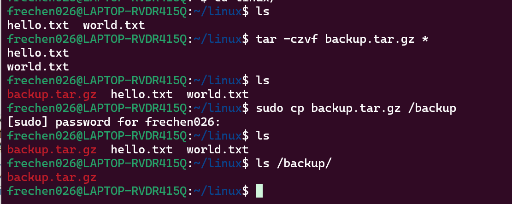
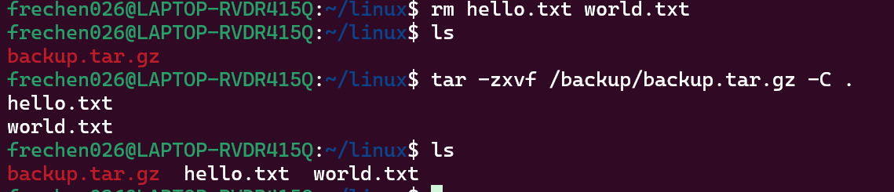
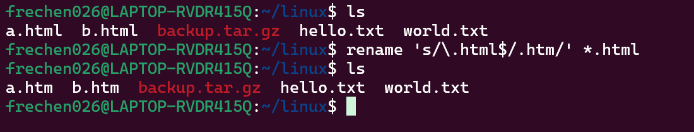
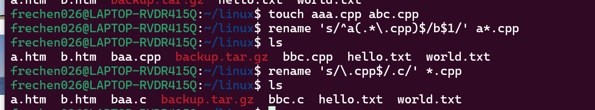
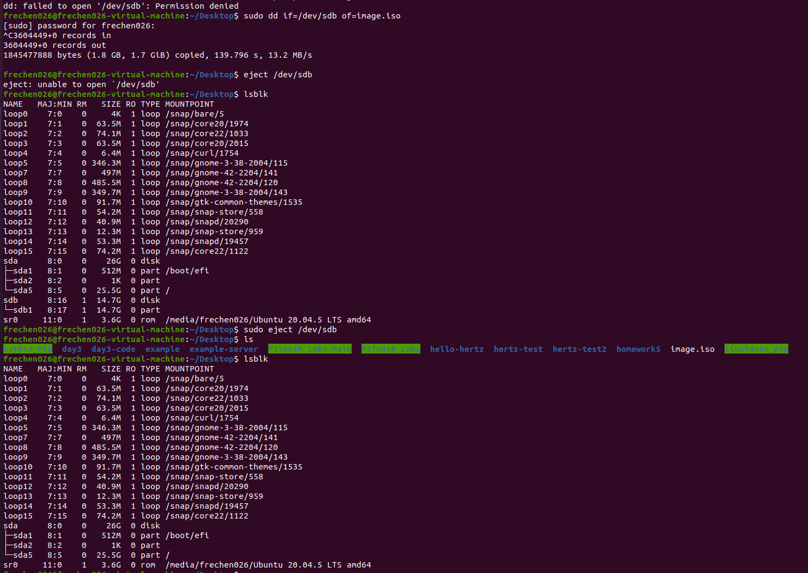
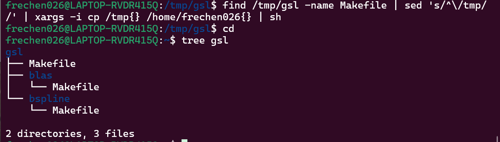

# homework1

**211250026 陈凯权**

作业环境：wsl + Ubuntu20.04

## 1

### a

将当前目录下所有文件备份并压缩成 tar.gz，如果成功再将备份拷贝到/backup 目录下。

操作指令：
```shell
tar -czvf backup.tar.gz *
sudo cp backup.tar.gz /backup
```



事先创建好/backup文件夹，压缩并备份拷贝

### b

操作指令：
```shell
tar -zxvf /backup/backup.tar.gz -C .
```

效果图如下：


为了体现出效果，将先前的文件删除，可以看到解压后原来的目录中存在解压后的文件

### c

操作指令：
```shell
rename 's/\.html$/.htm/' *.html
```



### d

操作指令：
```shell
rename 's/^a(.*\.cpp)$/b$1/' a*.cpp
rename 's/\.cpp$/.c/' *.cpp
```




## 2

### a

文本文件的不同：
- 换行符：
    - DOS/Windows使用回车符(CR)和换行符(LF)来表示换行，即\r\n。
    - UNIX/Linux使用换行符(LF)来表示换行，即\n。
    - Mac使用回车符(CR)来表示换行，即\r。
- 文件结尾符：
    - DOS/Windows使用回车符和换行符作为文件的结尾符。
    - UNIX/Linux使用换行符作为文件的结尾符。
    - Mac使用回车符作为文件的结尾符。
- 文件编码：
    - DOS/Windows常用的文本文件编码是ANSI或UTF-8。
    - UNIX/Linux常用的文本文件编码是UTF-8。
    - Mac常用的文本文件编码是UTF-8。

转换方案：
- DOS/Windows到UNIX/Linux：
    - 可以使用dos2unix命令将DOS/Windows格式的文本文件转换为UNIX/Linux格式
- UNIX/Linux到DOS/Windows：
    - 可以使用unix2dos命令将UNIX/Linux格式的文本文件转换为DOS/Windows格式
- Mac到UNIX/Linux：
    - 可以使用tr命令将Mac格式的文本文件转换为UNIX/Linux格式

### b

/etc/fstab文件中的各个字段功能如下：
- 设备文件或UUID：指定要挂载的文件系统的设备文件路径或UUID。
- 挂载点：指定文件系统挂载的目标路径。
- 文件系统类型：指定要挂载的文件系统类型，如ext4、ntfs、vfat等。
- 挂载选项：指定挂载文件系统的选项，如读写权限、自动挂载等。
- 备份频率：用于指定文件系统备份的频率，一般为0表示不备份。
- 自检顺序：用于指定文件系统自检时的顺序，一般为0表示不自检。

可看出我的linux设备中各个字段如下：


可看出wsl安装的linux子系统的设备名称为cloudimg-rootfs，挂载点为/，文件系统类型为ext4，挂载选项为默认，不备份，自检。

### c



笔者这里采用的是虚拟机，不知怎么的wsl下的ubuntu似乎并不能识别出U盘设备。

操作指令：
```shell
sudo dd if=/dev/sdb of=image.iso 
sudo eject /dev/sdb
```

由于先前未考虑虚拟机空间有限，U盘整个空间还是太大了，所以传了一部分被我终止了。

可以看到当前目录下新建了image.iso文件，同时弹出光盘后利用lsblk查看时已经没有该设备。

## 附加题

既然老师课上说过，这就是一个gsl的文件结构，我就上网自己下载了一份gsl并解压缩到/tmp目录下，不过好像并非向说明里一样就是block里面就不存在Makefile，而且各个文件中是Makefile.am和Makefile.in格式的文件。所以为了与题目一致，还是手动创建了一个文件结构差不多的文件夹。

结构如下：
```shell
.
├── INSTALL
├── Makefile
├── NEWS
├── blas
│   ├── ChangeLog
│   ├── Makefile
│   ├── TODO
│   └── blas.c
├── block
│   ├── ChangeLog
│   └── block.c
└── bspline
    └── Makefile
```

具体指令：
```shell
find /tmp/gsl -name Makefile | sed 's/^\/tmp//' | xargs -i cp /tmp{} /home/frechen026{} | sh
或：
find /tmp/gsl -name Makefile | sed 's|/tmp|/|' | xargs -I {} cp /tmp{} /home/frechen026{} | sh
```

