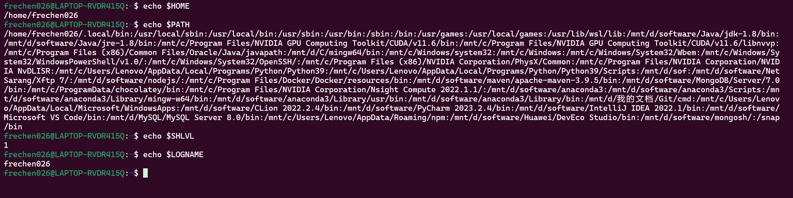

# 作业2

**211250026 陈凯权**

## 1.用命令行打印 HOME、PATH、SHLVL、LOGNAME 变量的值。

指令：
```shell
echo $HOME
echo $PATH
echo $SHLVL
echo $LOGNAME
```



## 2. 请用中文解释 Shell 脚本程序，并说明运行结果：

详细解释请看下方代码注释，简单来说就是1、清屏；2、给出选项；3、用户进行输入；4、根据用户输入执行不同操作，1则继续，2则结束，其他则提示用户并要求继续输入。

```shell
#!/bin/sh
# 指定执行该脚本的shell路径

clear
# 清屏

select item in Continue Finish
# 选择，用1、2列出Continue和Finish选项，读取用户输入并赋值给item

do
# 循环
case “$item” in
 Continue) ;;
 Finish) break ;;
 *) echo “Wrong choice! Please select again!” ;;
esac
# 条件语句，输入1则继续，输入2则跳出循环，其他输入则echo出提示

done
```


运行结果如下，可以看出，与之前解释的内容一致，首先清屏，而后给出用户选项，输入1并回车则继续，输入2并回车则结束，输入其他无关字符则提示选择错误请重新选择。


## 3. 阅读下列 Makefile 并用中文说明其含义。

```makefile
=========Makefile1========= 
export Top:=${shell pwd} 
# 将当前所在路径赋值给变量Top，并导出变量Top
export Src:=$(Top)/src/  
# 将当前路径下src文件夹的路径赋值给Src，并导出变量Src
export Include:=$(Top)/include/ 
# 将当前路径下include文件夹的路径赋值给Include，并导出变量Include
export Build:=$(Top)/build/ 
# 将当前路径下build文件夹的路径赋值给Build，并导出变量Build
all: 
	@$(MAKE) -C $(Src) 
    # 切换到文件夹src下，执行make命令(编译链接)
install: 
	@cp $(Build)/test $(Top) 
    # 将build文件夹下的test文件复制到当前目录下
clean: 
	@-rm -rf $(Build) $(Top)/test 
    # 强制删除build文件夹和当前目录下的test文件
    # '-'表示：在删除文件的过程中，如果碰到文件不存在或者已经创建，那么希望忽略掉这个错误，继续执行。
========= Makefile2========= 
all:main.o test4.o  
# make all指令指定依赖文件main.o和test4.o
	@mkdir -p $(Build) 
    # 递归构建Build变量指代的文件夹
	@mv *.o $(Build) 
    # 将当前目录下所有的.o后缀的文件或文件夹都移到Build变量指代的文件夹内
	$(MAKE) -C $(Src)/dir1 
    # 切换到Src变量指代的文件夹下的dir1文件夹，执行make命令
	$(MAKE) -C $(Src)/dir2 
    # 切换到Src变量指代的文件夹下的dir2文件夹，执行make命令
	$(CC) -o $(Build)/test $(Build)/*.o $(Build)/dir1/*.o $(Build)/dir2/*.o 
    # 使用gcc编译器，将后面所有文件进行静态链接，并将输出生成为$(Build)/test可执行文件
main.o : $(Include)/func.h 
    # 需要依赖Include变量指代的文件夹下的func.h头文件
	$(CC) -c main.c -I$(Include) 
    # 使用gcc编译器，并告诉编译器在Include变量指代的文件夹下寻找头文件，编译main.c文件获得main.o。
```

