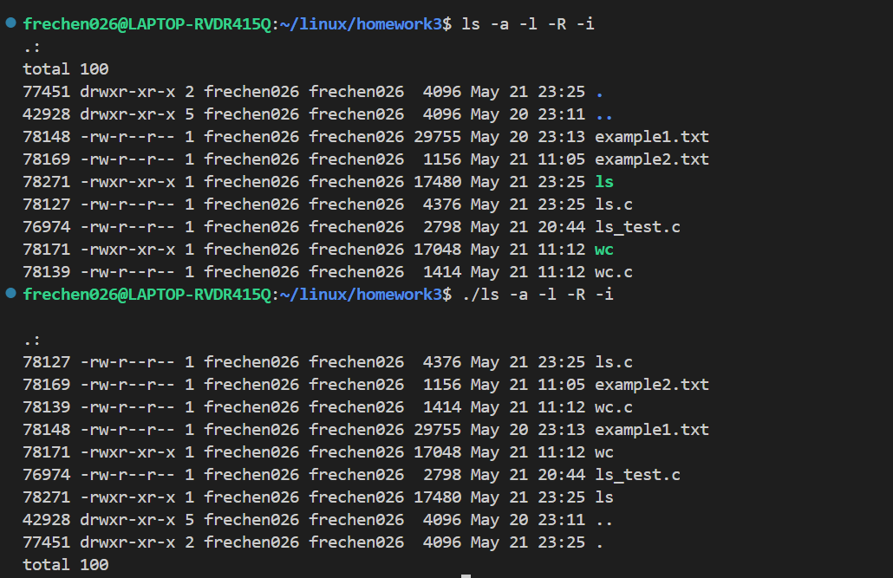

# 作业3

## 第一题

**在一个只有 128M 内存并且没有交换分区的计算机上，说说下面两个程序在编译及运行结果上的差别。**

```C
#define MEMSIZE 1024*1024
int count = 0;
void *p = NULL;
while(1) {
 p = (void *)malloc(MEMSIZE);
 if (!p) break;
 printf("Current allocation %d MB\n", ++count);
}
// 程序 2
#define MEMSIZE 1024*1024
int count = 0;
void *p = NULL;
while(1) {
 p = (void *)malloc(MEMSIZE);
 if (!p) break;
 memset(p, 1, MEMSIZE);
 printf("Current allocation %d MB\n", ++count);
}
```

我们可以观察到，两个程序绝大部分代码都完全一样，只是程序2多一个`memset`对于内存块进行写入的过程。

因此，两者在编译上并无明显区别，除了程序2编译时还需要对memset进行检查。

运行结果上来看，在一个linux系统上，我使用以下指令进行模拟一个只能使用128MB内存的系统：
```shell
ulimit -m 131072 # 限制进程最大内存使用量为 128MB
ulimit -v 131072 # 限制虚拟内存使用量为 128MB
```

两者运行结果如下：
```shell
# 程序1
real	0m0.003s
user	0m0.002s
sys	0m0.001s

# 程序2
real	0m0.134s
user	0m0.027s
sys	0m0.105s
```

- 程序1：在程序1中，每次循环分配1MB的内存，但并没有对这块内存进行初始化或写入操作。
- 程序2：与程序1不同，程序2在每次分配内存后使用memset函数将分配的内存块全部设置为1。这意味着程序2会在内存中写入大量数据。
- 可以发现，程序2由于需要进行对于内存的写入操作，运行程序所需要的时间较之程序1也要更久一些。
- 由于程序2需要实际写入内存需要维护一些堆栈所以需要消耗更多内存资源因此会在内存消耗更早的时间退出？不过我实验下来两者都只能大约分配123MB内存。

网上查询到的说法都是如下：
**第一道程序分配内存但没有填充，编译器可能会把内存分配优化掉，程序死循环；第二道，程序分配内存并进行填充，系统会一直分配内存，直到内存不足，退出循环。**

但我本人进行实验时并未发现程序1会陷入死循环的情况？对于编译开了优化似乎也并未发生该情况，不是很理解。不过鉴于本人实验环境并未真正满足128MB内存且无交换分区，所以我对于上述实验结果也存有疑问。

## 第二题

**请使用程序设计语言(如 C 语言)，编程实现“ls”和“wc”命令，要求实现如下参数与功能(注: ls 的 5 个参数要求能组合，不需要实现参数连写，也不需要实现参数的任意次序; wc 不需要实现参数，只要后面跟文件名即可)。
ls –l(-d, -R, -a, -i)
wc [filename]
完成实现后，查找原命令的源代码，对其进行阅读分析，与自己的版本作比较，看有何不同，并将不同之处写入文档。
要求：
(1) 文档（包括 specification 文档和设计文档，可以二合一）言简意赅，简洁明了。
(2) 注意代码风格。
补充说明: 一些细节可以不实现，例如参数解析时-al 的连写、ls -l 在遇到链接文件时对链接文件的打印等等。要求实现同时输入多个参数，可以固定次序。**


### 规格说明

`ls`命令：
- `无参数`：显示目录下文件，不含隐藏文件
- `-l`：显示目录下详细列表，包括文件大小、权限、所有者、修改时间等信息。
- `-d`：仅列出目录本身，而不是目录的内容。
- `-R`：递归列出所有子目录的内容
- `-a`：显示所有文件，包括隐藏文件
- `-i`：显示每个文件的inode号

`wc`命令：
- 统计给定文件的行数、单词数和字符数

### 设计文档

`ls`命令设计：
- 读取参数并根据参数设置标志位
- 由于`-d`的特殊性，单独处理`-d`
- 打开指定目录并进行读取
- `-l`需要特定格式的输出，抽离出`print_mode`打印权限
- 同时`-l`需要计算`total`值与`ls -l`功能保持一致，虽然题目并未要求
- `-R`的递归处理，需要特殊处理，先将目录下文件加以打印，后进行集中递归，使用两个`while`循环实现这一点


`wc`命令设计：
- 使用`open`和`read`函数来读取指定文件的内容
- 使用`while`循环逐行读取文件内容
- 每次读取一个字符，判断是否遇到特殊字符例如换行符
- 输出行数、单词数、字符数、文件名，规范化输出格式

### `ls`命令


具体代码清自行实现。

效果如下(每张截图由两部分组成，上面为`ls`指令效果，下面为本人实现效果)：
- `ls`:
- 
- `ls -l`:
- 
    - 由于我是先对于文件进行遍历打印，同时进行统计，故而最后打印`total`结果，同时可以看到，`ls -l`指令应该是采用了某种组织方式进行顺序的排序。
- `ls -d`:
- 
- `ls -R`:
- 
- `ls -a`:
- 
- `ls -i`:
- 
- **参数组合**(以`-a -l -R -i`组合举例)
- 
- 实现功能：5个参数能组合且位置顺序不固定，可为任意次序。

### `wc`命令

具体代码也请自己实现。

效果如下，与`wc`命令执行效果大致相同，规范输出形式，不足五位使用空格加以补齐。


补充：`wc`支持多文件读取。


### 与源码比较？

在GNU官网上找到了`Coreutils`源码并加以阅读，如下：


说实话源码完全阅读起来也是十分困难的🤣，我原先实现`ls`和`wc`功能的时候也想去借鉴源码的实现，结果发现大部分看不懂🤣。

总的来讲有以下区别：
- 错误处理：原命令的错误处理机制相较于我们的十分简陋的实现更加完善，对于边界条件等等的检查也更加的详细。
- 可读性和可维护性：原命令的实现代码采取了一些优秀的设计模式，使得代码的可维护性更高，使得代码更加容易扩展和维护。
- 复杂性：相比于我们的简陋实现，源码的实现要复杂很多，这也使得能够处理更多的情况，使用更高性能的实现机制。
