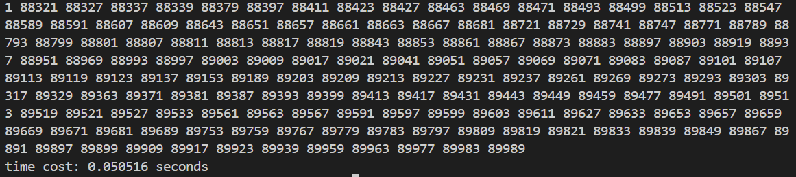

# 作业4

**211250026 陈凯权**

## 第一题

**查找 1~N 之间的所有素数（N 可以为十万、一百万或一千万等）。先用串行程序，再分别将其并行化（多线程程序，利用 POSIX Thread 库），并在 Linux 平台上对性能进行分析。**

**要求：给出源代码及性能分析的文档。（文档中需要给出程序运行的串行时间， 并行时间，并对当前性能好坏的原因做一定的分析）**

### 串行程序

代码如下：

具体代码请自行实现。

获取参数作为`N`，对于`1-N`之间的数字进行逐个判断是否为素数，是素数则打印出来，优化手段，只判断到该数字的平方根，节省判断时间。

效果如下：
- `N=100000`，耗时`0.012937s`

- `N=1000000`，耗时`0.291577s`

- `N=10000000`，耗时`6.718214s`


可以看出查找`1-N`之间素数的程序，随着N的增大，时间呈现出爆发式增长，而非线性增长。

### 并行化

采取`POSIX Thread`库进行并行化，代码如下：

具体代码请根据课堂所讲内容自行实现。

一共开了10个线程加以运算，每个线程负责一定范围内的数字计算是否为素数。

结果如下：
- `N=100000`，耗时`0.050516s`

- `N=1000000`，耗时`0.681025s`

- `N=10000000`，耗时`10.914775s`


这里我犯了一个错误，计算出的时间是所有线程的时间，而不仅仅是主线程。不过将错就错我们可以看出使用`POSIX Thread`进行并行化其实是需要消耗更多的CPU资源的，包括线程创建、退出、合并的过程中都需要消耗额外的系统资源。故而总的CPU耗时要更加的多。

使用`time`查看实际运行时长，例
```shell
time ./prosix_prime 100000
```

结果如下：
- `N=100000`，耗时`0.022s`


- `N=1000000`，耗时`0.548s`
  


- `N=10000000`，耗时`2.796s`
  


随着`N`取值的增大，可以看出并行化的优势也就越明显，耗时也就越短。不过当`N`较小时，线程所带来的额外成本可能大于多线程对于运算带来的效益。

一个有意思的地方：


单线程执行的程序似乎并不是只会使用唯一的CPU核心，现代操作系统可能会在不同的核心之间移动该线程以平衡负载。

## 第二题

**请用中文描述一下字符型 Linux 驱动模块的编写以及编译过程？**

字符型`Linux`驱动模块的编写过程大致包括以下步骤：
- 创建一个`.c`文件，编写驱动模块的代码。
- 在代码中包含必要的头文件，如`<linux/module.h>`和`<linux/init.h>`等。
- 定义模块的初始化函数和释放函数，分别使用`module_init()`和`module_exit()`进行注册和释放。
- 在初始化函数中，注册字符设备并分配设备号。
- 实现对字符设备的操作函数，包括`open`、`release`、`read`、`write`等。
- 编写`Makefile`文件，指定驱动模块的编译规则和生成目标。

编译过程一般分为以下几个步骤：
- 编辑`Makefile`文件，指定编译驱动模块的规则和依赖关系。
- 在终端中切换到驱动模块的源代码目录下。
- 输入`make`命令进行编译。编译成功后，将生成`.ko`文件。
- 使用`insmod`命令将`.ko`文件加载到内核中。
- 使用`lsmod`命令查看已加载的模块和模块间的依赖关系。
- 使用`rmmod`命令卸载模块。

通过以上步骤，就可以完成字符型Linux驱动模块的编写和编译过程。

值得注意的是，依据课堂所讲内容以及我的笔记，Linux驱动模块编写和编译需要注意以下几点：
- 编译需要内核头文件的支持
- 加载和释放驱动模块，可以使用较为底层的命令例如`insmod`和`rmmod`，也可以使用高层的命令`modeprobe`和`modeprobe -r`进行一些更加自动化的操作。
- 需要注意内核模块无`main`函数且内核驱动程序经常是并行的，不想用户程序指定是串并行，因此内核程序调试起来十分复杂，例如打印机时钟驱动。
- 不能使用C库来开发驱动程序，层次还在库函数之下，只能使用内核内的其他代码。
- 没有内存保护机制，一点点内存泄漏就可能造成严重后果。
- 小内核栈，内核代码一般没有递归，会占用大量内存。
- 内核模块例如驱动的接口，对上需要与系统进行协议，对下需要与硬件打交道。一般来讲，与硬件打交道逻辑不固定，与具体硬件设施相关，与应用程序提供的接口较为固定。
